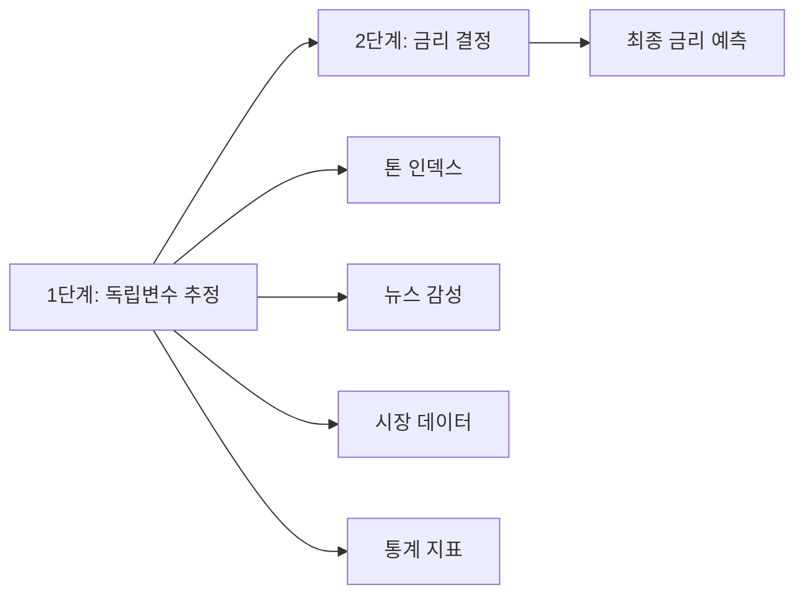
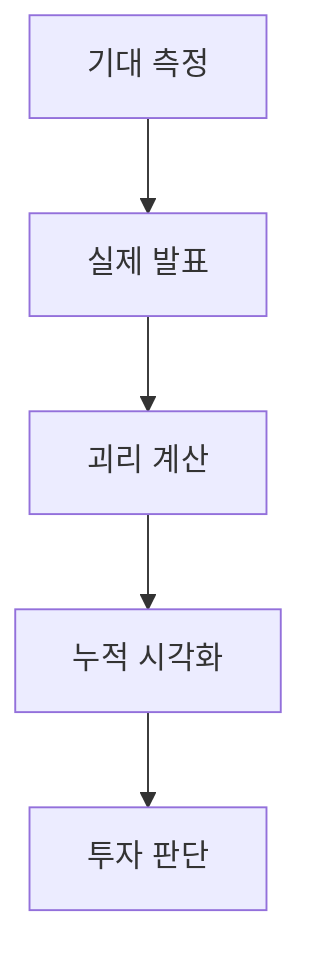
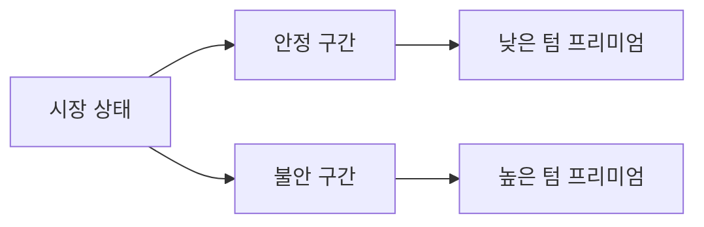
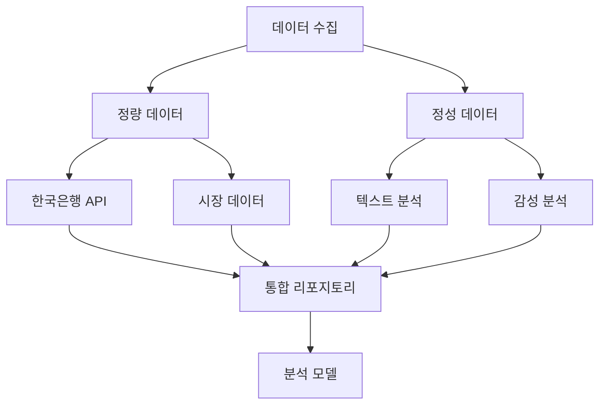
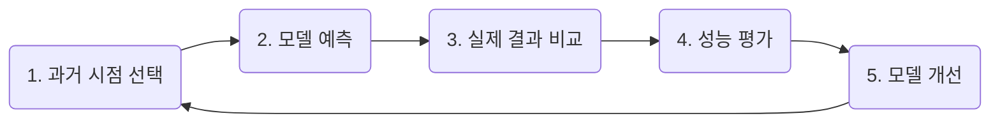
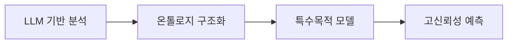
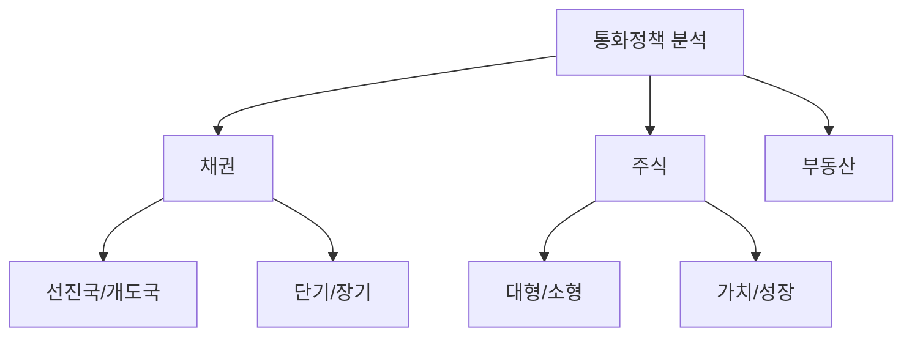

---
title: 테일러 룰 기반 통화정책 분석 모델
date: 2026-02-12
tags:
  - 경제
  - 통화정책
  - 테일러룰
  - 금리예측
  - 트레바리
type: 회의록
status: 진행중
meeting_location: 삽입 위치
related_projects:
  - 경제 프로젝트
  - 통화정책 분석 모델
next_meeting: 2026-02-25
action_deadline: 2026-02-26
---

# 02-12 회의: 테일러 룰 기반 통화정책 분석 모델

> [!abstract] 회의 요약
> 테일러 룰을 기반으로 한 통화정책 분석 모델 개발 회의. 톤 인덱스 정의, 시장 반응 분석, 텀 프리미엄 해석, 데이터 파이프라인 구축 및 백테스트 계획을 논의했습니다.

## 📊 시각화 자료

> [!tip] 모델 구조 이해하기
> 전체 모델의 구조를 한눈에 보려면 아래 다이어그램을 확인하세요!
>![[Pasted image 20260216001658.png]]

## 🔑 핵심 개념 설명

> [!note] 테일러 룰(Taylor Rule)이란?
> 1993년 경제학자 존 테일러가 제안한 금리 결정 공식입니다.
>
> **공식:**
> $$금리 = 중립금리 + a \times (인플레이션\ 갭) + b \times (GDP\ 갭)$$
>
> - **중립금리**: 경제를 가열하거나 냉각시키지 않는 금리
> - **인플레이션 갭**: 실제 물가상승률 - 목표 물가상승률
> - **GDP 갭**: 실제 GDP - 잠재 GDP (경제 과열/침체 정도)
>
> 📌 **쉽게 설명하면:** 물가가 너무 오르거나 경제가 과열되면 → 금리 인상, 반대면 → 금리 인하

> [!info] 톤 인덱스(Tone Index)
> 중앙은행(한국은행)의 통화정책 방향성을 나타내는 지표입니다.
>
> **구성 요소:**
> - 📝 **텍스트 분석**: 통화정책 결정문, 기자회견 내용
> - 📈 **시장 반응**: 채권금리, 주가 등의 움직임
> - 📰 **뉴스 감성**: 언론 보도의 긍정/부정 분석
>
> **매파(Hawk) vs 비둘기파(Dove):**
> - 🦅 **매파**: 물가 안정 중시 → 금리 인상 선호
> - 🕊️ **비둘기파**: 경제 성장 중시 → 금리 인하 선호

> [!example] 텀 프리미엄(Term Premium)
> 장기 채권 투자 시 받는 추가 보상입니다.
>
> **공식:**
> $$10년물\ 수익률 = 기대\ 기준금리 + 텀\ 프리미엄$$
>
> **예시:**
> - 10년 국채금리가 2.25%라면?
>   - 향후 평균 기준금리 예상: 1.75%
>   - 텀 프리미엄: 0.50%
>
> 💡 **의미**: 장기간 돈을 묶어두는 위험에 대한 보상

---

## 📋 회의 정보

| 항목 | 내용 |
|------|------|
| 📅 날짜 | 2026-02-12 19:01:26 |
| 📍 장소 | [삽입 위치] |
| 👥 참석자 | Speaker 1, 박종호 |

---

## 📝 회의 노트

### 1️⃣ 통화정책 분석 모델 개선 방향

> [!warning] 현재 문제점
> - 키워드 기반 매파/비둘기파 구분의 가중치(0.5~3) 의미가 불명확
> - 단순 점수인지, 모델 파라미터 조정인지 구분 필요

**주요 논의 내용:**
- 전문가 설정과 심층 분석 데이터 소스 검증 항목이 존재하며 최근 일부 변경됨
- 가중치가 단순 웨이팅인지, 모델 파라미터(알파/베타 등) 해석 조정인지 구분 필요
- 단어별 중요도 차등 적용, 단어 조합과 컨텍스트(언어 구조) 반영 제안
- 총재 기자회견의 톤, 강조점, 맥락 등 정성변수를 모델에 포함 필요

> [!success] 결론
> 테일러 룰 기반의 핵심 구조에 정량·정성 변수(톤, 뉴스 감성, 통계)를 혼합해 정교화

---
        
### 2️⃣ 테일러 룰과 금융안정 변수 포함

> [!tip] 모델의 핵심 구조
> 테일러 룰을 **기본 축**으로 채택 → 모든 계산의 시작점

**확장 방안:**
- 기존 테일러 룰에 **금융안정 요소** 추가:
  - 🏠 가계대출 규모
  - 🏢 부동산 가격 변동
- 톤 인덱스는 GDP/물가에 대한 금통위 판단을 내포하므로 독립변수 추정에 활용 가능

**2단계 분석 구조:**
1. **독립변수 추정**: 톤, 뉴스, 시장, 통계
2. **금리 결정**: 테일러 룰 방정식 적용

> [!warning] 순환 논리 위험
> 초기에는 단순 모델로 시작 → 동시방정식/식별 제약 등으로 점진적 확장

> [!success] 결론
> 금융안정 지표를 포함한 테일러 룰을 기본 축으로, 톤 등 정성데이터를 보강해 시작

---
        
### 3️⃣ 톤 인덱스·톤 파라미터 정의와 역할

> [!info] 톤 인덱스 vs 톤 파라미터
> - **톤 인덱스**: "무엇을" 시사하는가 (미래 금리 방향)
> - **톤 파라미터**: "얼마나 확실한가" (정책 실행 확률)

#### 📊 톤 인덱스 (Tone Index)

매파/비둘기파 톤을 종합한 **합성 지표**

**구성 요소:**

| 구성 요소 | 설명 | 예시 |
|----------|------|------|
| 📝 텍스트 분석 | 통화정책 결정문, 기자회견 | "물가 상승 압력 주시" → 매파 |
| 📈 시장 반응 | 채권금리, 주가 변동 | 발표 후 국채금리 상승 → 매파 |
| 📰 뉴스 감성 | 언론 보도 분석 | "긴축 기조 유지" → 매파 |

**다층 구조:**
- 🏦 **중앙은행 톤 인덱스**: 한국은행의 의도
- 📊 **시장 수용 톤 인덱스**: 시장이 받아들인 신호

#### 🎯 톤 파라미터 (Tone Parameter)

정책 실행 **확률과 의지**를 표현

> [!example] 예시
> - 현재 기준금리: 2.5%
> - 톤 인덱스: 2.3% 시사
> - 톤 파라미터: 50bp 인상 가능성 70%

**구분:**
- ⏰ **현재**: 실제 기준금리
- 🔮 **미래**: 톤 인덱스가 예상하는 금리

> [!success] 결론
> 톤 인덱스를 텍스트·시장·뉴스 감성으로 재정의하고, 정책 확률은 톤 파라미터로 분리

---
        
### 4️⃣ 시장 반응과 기대 대비 정책 해석

> [!important] 핵심 개념
> 시장은 **절대적 수치**가 아닌 **기대 대비 차이**에 반응합니다!

#### 📉 기대-실제 괴리의 영향

**시나리오 예시:**

| 시장 기대 | 실제 발표 | 신호 성격 | 시장 반응 | 이유 |
|----------|----------|---------|----------|------|
| 금리 동결 | 25bp 인하 | 🕊️ 비둘기 | ✅ 채권금리 하락 | 기대보다 완화적 |
| 50bp 인하 | 25bp 인하 | 🕊️ 비둘기 | ❌ 채권금리 상승 | 기대보다 덜 완화적 |
| 금리 동결 | 금리 동결 | 중립 | → 변동 없음 | 기대와 일치 |

> [!example] 실제 사례
> "비둘기 신호라도 기대 대비 덜 비둘기이면 채권금리 상승 가능"
>
> → 시장이 50bp 인하를 기대했는데 25bp만 인하 → 실망 매도

#### 📊 활용 방안

> [!success] 결론
> 기대-실제 괴리 해석 모듈과 시장 반응 지표의 가중치·방향성 표기 기능 필요

---
        
### 5️⃣ 금리 경로 의존성·채권금리 해석(텀 프리미엄)

> [!note] 채권금리 분해 공식
> $$10년물\ 수익률 = 기대\ 기준금리 + 텀\ 프리미엄$$

#### 📈 텀 프리미엄 이해하기

**예시로 배우기:**

| 10년 국채금리 | 기대 기준금리 | 텀 프리미엄 | 해석 |
|-------------|------------|-----------|------|
| 2.25% | 1.75% | 0.50% | 정상적 수준 |
| 2.75% | 2.25% | 0.50% | 금리 인상 기대 상승 |
| 2.25% | 1.75% | 0.50% → 0.70% | 불확실성 증가 |

> [!example] 실제 해석 사례
> **상황:** 10년물 금리가 2.25% → 2.75%로 급등
>
> **해석:**
> - 시장의 향후 기준금리 기대가 1.75% → 2.25%로 상향 조정
> - 또는 텀 프리미엄 증가 (불확실성 반영)

#### 📊 Volatility Clustering 고려

**안정 구간 vs 불안 구간:**

- 🟢 **안정 구간**: 텀 프리미엄 낮음 (0.3~0.5%)
- 🔴 **불안 구간**: 텀 프리미엄 높음 (0.7~1.0%)

> [!tip] 분석 원칙
> 시장 데이터만으로 분석 → 객관성 확보

> [!success] 결론
> 텀 프리미엄·기대 경로 기반의 시장금리 해석 로직을 모델에 포함

---
        
### 6️⃣ 데이터 소스와 구현 현황

> [!todo] 데이터 파이프라인 구축
> 다양한 소스에서 데이터를 수집하고 통합하는 시스템 구축 중

#### 📊 데이터 소스 구성

**데이터 유형:**

| 유형 | 소스 | 상태 |
|------|------|------|
| 📊 거시경제 지표 | 한국은행 경제통계 시스템 API | 🔄 연계 진행 중 |
| 📈 시장 데이터 | 채권금리, 환율, 주가 | 📝 전략 수립 필요 |
| 📝 텍스트 데이터 | 보도자료, 기자간담회, 통화자료 | 🔄 리포지토리 설계 중 |
| 📰 감성 분석 | 뉴스, 언론 보도 | 📝 수집 전략 필요 |

#### 🏗️ 인프라 계획

- **리포지토리**: 도메인별 데이터 저장소
- **벡터화**: 텍스트 데이터 임베딩
- **인덱스**: 빠른 검색을 위한 색인
- **API**: 외부 접속 개방 (접속료·가입 모델 검토)

> [!success] 결론
> 한국은행 API로 정량 데이터 확보, 시장 반응·감성 데이터 수집·표현 개선과 리포지토리·인덱스·서버 아키텍처 구상 착수

---
        
### 7️⃣ 모델 적용 범위 및 검증·백테스트

> [!info] 백테스트(Backtest)란?
> 과거 데이터로 모델을 검증하는 방법입니다.
>
> **예시:** 2025년 10월 데이터로 11월 금리를 예측 → 실제 결과와 비교

#### 🔍 검증 프로세스

**검증 단계:**

| 단계         | 내용                    | 데이터            |
| ---------- | --------------------- | -------------- |
| 1️⃣ 지표 설정  | 통화정책 결정문 + 기자회견 자료 분석 | 2025.10, 11월 등 |
| 2️⃣ 예측 수행  | 모델로 다음 분기 금리 예측       | 과거 시점          |
| 3️⃣ 적중률 평가 | 실제 결과와 비교             | 실제 금리 결정       |
| 4️⃣ 성능 측정  | 정확도/설명력/적중률 산출        | 통계 지표          |

#### 📊 목표 성능 지표

- **정확도**: 예측값과 실제값의 차이
- **설명력**: 모델이 현상을 설명하는 능력 (R²)
- **적중률**: 방향성 예측 정확도 (인상/인하/동결)

> [!tip] 효율적 분석
> 팔란티어(Palantir) 사례처럼 정보 수집 타깃을 명확히 해 효율적 토론·분석 추진

> [!success] 결론
> 기본 모델로 시작해 변수 해석을 점진적으로 보완하며 히스토리 백테스팅으로 최적 조합 탐색

---
        
### 8️⃣ 해외 변수 반영 방식과 환율 처리

> [!note] 간접 반영 원칙
> 해외 요인을 직접 모델에 넣지 않고, 국내 시장 데이터를 통해 간접 반영

**처리 방식:**

| 요인 | 반영 방식 | 예시 |
|------|----------|------|
| 🇺🇸 FED 금리 결정 | 국내 시장 데이터에 내재 | 채권금리 변동으로 반영 |
| 💱 환율 | 물가 영향 경로 | 수입물가 → CPI |
| 🌍 글로벌 경제 | 시장 반응 | 주가, 환율 변동 |

**변수 분류:**
- ✅ **독립변수**: 금리 (직접 예측)
- ➡️ **영향변수**: 환율 (간접 영향)

> [!success] 결론
> 해외 변수·환율을 간접 반영하는 설계 원칙 재확인

---
        
### 9️⃣ 온톨로지 기반 경제 지식 체계

> [!info] 온톨로지(Ontology)란?
> 개념들 간의 관계를 체계적으로 정리한 지식 구조입니다.
>
> **예시:** "금리 인상" → "채권가격 하락" → "주식 부정적" (인과관계 정의)

**목표:**
- 시장·텍스트·단어 등 다양한 데이터를 **연결**
- 마인드맵처럼 **구조화** (브레이크다운/링크/중심 노드)

**발전 경로:**

> [!warning] 한계 인식
> 프롬프팅만으로는 한계 → 체계적 구조 필요

> [!success] 결론
> 장기적으로 온톨로지 도입으로 분석 신뢰성과 확장성 제고

---
        
---

## 📅 프로젝트 실행 계획

### 🏦 한국은행 금통위 분석 일정

> [!important] 2026년 2월 26일 금통위 분석 일정
>
> **장소:** 서초동 국립중앙도서관
>
> | 시간 | 활동 |
> |------|------|
> | 09:30 | 팀 집결 및 사전 논의 시작 |
> | 09:30~10:20 | 전망 4개 파트 논의 (각 10분) |
> | 10:20~10:30 | 휴식 |
> | 10:30 | **금통위 결정문 공개** 📢 |
> | 10:30~11:30 | 실시간 분석 및 자유토론 |
> | 13:00 | 재모임, 디브리핑, 총평 |
>
> **핵심 초점:**
> 1. 🎯 정책 방향의 속내
> 2. 📊 시장 반응 분석

**역할 분담:**
- ✅ 연구위원: 디브리핑까지 참여
- ✅ 전문가/은퇴자: 역할 정의 필요
- ⚠️ 내부 자료 활용: 규정 준수

**사전 점검:**
- 📅 2월 25일: 사전 점검 미팅 (대면/줌)

---
        
### 📊 자산군 분석 계획

**목표:** 통화정책이 자산별로 미치는 영향 분석

---

### 🎬 미디어·콘텐츠 생산 계획

| 포맷 | 내용 | 상태 |
|------|------|------|
| 🎙️ 팟캐스트 | 구간 편집, 익명 공개 | 기획 중 |
| 📺 유튜브 | 실황/주간 후속 분석 | 스튜디오 예약 필요 |
| 📄 보고서 | AI 초안 + 연구위원 수정 | 진행 중 |
| 📰 잡지형 텍스트 | 전문가 대화 정리 | 기획 중 |

**다음 회차 계획:**
- AI 생성 '통화정책 결정문' 테스트 및 피드백

---

### 🌍 글로벌 확장 계획

**네트워크 활용:**
- 한국은행 은퇴자·금통위원
- 개도국 컨설팅·IMF 교육
- 해외 유사 연구 기관 협력 (미국·영국·일본)

---

### 📅 운영 캘린더

**2026년 일정:**
- **2월**: 첫 시행 (통화정책 중심)
- **연 8회**: 금통위 개최 시기에 맞춰 분석
- **3월**: 휴식 및 리뷰
- **4월**: 재개 및 인원 조정 검토

---

### 🤖 AI 모델 및 비용 비교

| 모델 | 성능 | 비용 | 비고 |
|------|------|------|------|
| ChatGPT (코덱스) | ⭐⭐⭐ | 💰💰 | 범용성 우수 |
| Google Gemini | ⭐⭐⭐ | 💰💰 | 다국어 지원 |
| Claude | ⭐⭐⭐⭐ | 💰💰💰 | 성능 우수, 비용 부담 |
| Moonshot (Kimi) | ⭐⭐⭐ | 💰 | **비용 1/10, 가성비 최고** |

> [!warning] API 비용 주의
> API 사용 시 비용 급증 가능 → 사용량 모니터링 필요

> [!tip] NVIDIA 관련 무료 배포 가능성 탐색 중

---
        

---

## ✅ 다음 일정 (Action Items)

### 🔧 모델 개발
- [ ] 테일러 룰 기본 탭 설계 및 금융안정 지표 포함 모델 초안 작성
- [ ] 키워드 가중치 체계 설계안 마련
- [ ] 톤 인덱스 정의서 작성 및 시각화 설계
- [ ] 텀 프리미엄 기반 채권금리 해석 모듈 추가
- [ ] 백테스트 수행 및 모델 적합도 초기 수치 산출

### 📊 데이터 인프라
- [ ] 한국은행 경제통계 시스템 API 정식 연계
- [ ] 데이터 파이프라인 구축
- [ ] 시장 반응 지표 수집 (국채금리 등)
- [ ] 기대-실제 괴리 누적 시각화 구현
- [ ] 데이터 리포지토리/인덱스/서버 아키텍처 초안 작성

### 📅 2월 26일 금통위 준비
- [ ] **2월 25일**: 사전 점검 미팅 (대면/줌)
- [ ] **2월 26일 10:00**: 서초동 국립중앙도서관 집결
- [ ] **2월 26일 10:30**: 결정문 실시간 확인 및 분석
- [ ] 전문가/은퇴자 역할 정의 및 아젠다 확정

### 🎬 콘텐츠 제작
- [ ] 팟캐스트/유튜브/보고서 생산 일정 수립
- [ ] 촬영 스튜디오 예약
- [ ] AI 통화정책 결정문 테스트 및 피드백 수집

### 🌍 장기 과제
- [ ] 분석 프레임워크 온톨로지화 방향성 초안
- [ ] 해외 유사 프로젝트 파트너 탐색
- [ ] 글로벌 확장 시나리오 작성
- [ ] 테일러 룰 역사·적용 논쟁 자료 수집

---
    

## 💡 AI 제안 (개선 과제)

### 🔧 기술적 명확화
1. ⚙️ **가중치 체계 정의**: 수학적 의미 및 정규화 방법 명확화
2. 🎯 **파라미터 분리**: 가중치 조정 vs 파라미터 해석 조정 경계 설정
3. 📊 **톤 파라미터 산출**: 학습 데이터 소스 및 확률 분포 가정 확정
4. 📈 **기대-실제 괴리 측정**: 측정 기준 및 시각화 표준 마련
5. 💹 **텀 프리미엄 방법론**: 측정 방법 및 안정/불안 구간 정의 표준화

### 📊 모델 검증
6. ✅ **백테스트 지표**: 정확도, 설명력, 적중률의 목표 수치 설정
7. 🌍 **해외 변수 반영**: 간접 반영 규칙 스키마 문서화
8. 🔤 **텍스트 분석 방식**: N-gram, 문맥 임베딩 등 방법 선정

### 🏗️ 인프라 구축
9. 🖥️ **데이터 리포지토리**: MVP 범위, 리소스, 외부 API 정책 확정
10. 🎙️ **녹취 데이터 구조화**: 스키마, 도구, 품질 기준 정의
11. 🤖 **AI 결정문 테스트**: 절차, 평가 기준, 피드백 루프 구체화

### 📚 문서화 및 표준화
12. 📖 **테일러 룰 자료**: 범주 및 제공 형식 확정
13. 🏷️ **명명 규칙**: 모델/지표 명명 체크리스트 수립
14. 🌏 **글로벌 확장**: 국가별 커스터마이징 가이드라인
15. 🎬 **콘텐츠 기준**: 공개 주기, 품질 기준, 일정
16. 📜 **운영 가이드라인**: 네트워크 운영 법적·윤리 기준

---

## 📖 초보자를 위한 용어집

> [!info] 자주 나오는 용어 설명

### 금융·경제 용어

| 용어 | 영문 | 설명 | 예시 |
|------|------|------|------|
| **기준금리** | Base Rate | 중앙은행이 정하는 기본 금리 | 한국은행 기준금리 2.5% |
| **금통위** | Monetary Policy Board | 금융통화위원회 (한국은행 금리 결정 기구) | 연 8회 개최 |
| **매파** | Hawk | 금리 인상을 선호하는 입장 | 🦅 물가 안정 중시 |
| **비둘기파** | Dove | 금리 인하를 선호하는 입장 | 🕊️ 경제 성장 중시 |
| **bp** | Basis Point | 0.01% (금리 단위) | 25bp = 0.25% |
| **GDP 갭** | Output Gap | 실제 GDP - 잠재 GDP | (+) 과열, (-) 침체 |
| **인플레이션 갭** | Inflation Gap | 실제 물가 - 목표 물가 | (+) 물가 상승 압력 |
| **중립금리** | Neutral Rate | 경제를 가열/냉각하지 않는 금리 | 약 2.0~2.5% |

### 기술·분석 용어

| 용어 | 영문 | 설명 | 예시 |
|------|------|------|------|
| **백테스트** | Backtest | 과거 데이터로 모델 검증 | 2025년 데이터로 예측 검증 |
| **온톨로지** | Ontology | 개념 간 관계 체계화 | 금리↑ → 채권가격↓ |
| **감성 분석** | Sentiment Analysis | 텍스트의 긍정/부정 판단 | 뉴스 기사 분석 |
| **임베딩** | Embedding | 텍스트를 숫자로 변환 | "금리 인상" → [0.2, 0.8, ...] |
| **MVP** | Minimum Viable Product | 최소 기능 제품 | 핵심 기능만 구현 |
| **API** | Application Programming Interface | 프로그램 간 연결 인터페이스 | 한국은행 데이터 API |

### 시장·투자 용어

| 용어 | 영문 | 설명 | 예시 |
|------|------|------|------|
| **국채금리** | Government Bond Yield | 국채 수익률 | 10년물 국채 2.25% |
| **텀 프리미엄** | Term Premium | 장기 투자 추가 보상 | 0.5% |
| **변동성** | Volatility | 가격 변동 폭 | 높을수록 불안정 |
| **적중률** | Hit Rate | 예측 정확도 | 10회 중 8회 적중 = 80% |

---

## 🔗 관련 자료

- [[1. Project/트레바리 - 경제 프로젝트/테일러 룰 모델 구조도.canvas|모델 구조 다이어그램]]
- #경제 #통화정책 #테일러룰 #금리예측

---

## 📝 메타데이터

**최종 수정일**: 2026-02-12
**다음 점검일**: 2026-02-25
**중요 마감일**: 2026-02-26 (금통위 분석)