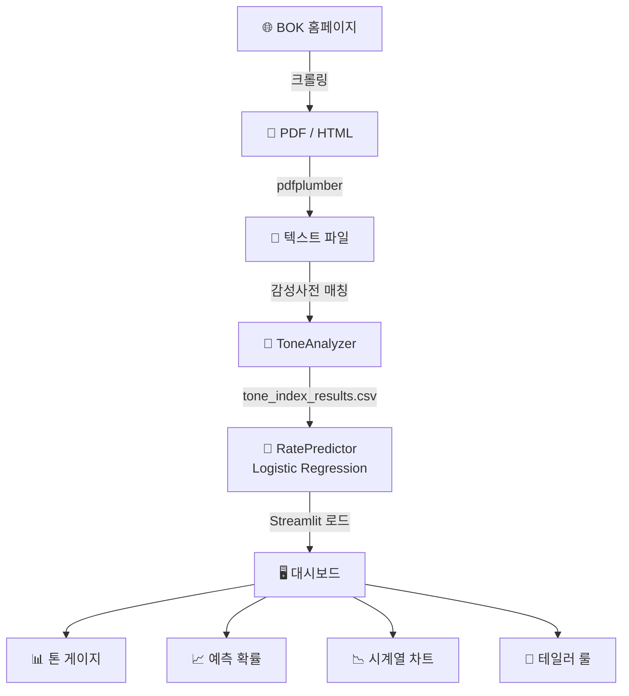

# 🏦 BOK Policy Analyzer v3 — 시스템 분석 리포트

## 📌 프로젝트 개요

한국은행(BOK) 금융통화위원회 의사록을 AI로 분석하여 통화정책 톤(Hawkish/Dovish)을 수치화하고, 다음 금통위 금리 결정을 예측하는 Streamlit 대시보드.

> [!warning] 주의
> 앱 헤더에 명시: "비공식/테스트용임!"

---

## 🏗 전체 아키텍처

```
bok_policy_analyzer_v3/
├── app.py                    ← Streamlit 메인 대시보드
├── src/
│   ├── nlp/                  ← NLP 분석 엔진
│   │   ├── sentiment_dict.py ← 한국어 통화정책 감성사전
│   │   ├── tone_analyzer.py  ← 톤 지수 계산기
│   │   ├── tone_analyzer_v2.py
│   │   └── preprocessor.py  ← 텍스트 전처리
│   ├── models/               ← ML 예측 모델
│   │   ├── rate_predictor.py ← 금리 결정 확률 예측
│   │   ├── backtest.py       ← 백테스트
│   │   └── lag_analysis.py   ← 지연효과 분석
│   ├── crawlers/             ← 데이터 수집
│   │   ├── bok_minutes_crawler.py  ← 의사록 크롤러
│   │   ├── bok_outlook_crawler.py  ← 경제전망 크롤러
│   │   └── pdf_downloader.py
│   ├── taylor_rule.py        ← 테일러 룰 계산기
│   ├── ecos_loader.py        ← 한국은행 ECOS API 연동
│   └── views/                ← UI 뷰 컴포넌트
│       ├── analysis_view.py  ← 심층 분석 뷰
│       ├── settings_view.py  ← 전문가 설정
│       └── taylor_view.py    ← 테일러 룰 시각화
└── data/
    ├── 01_minutes/           ← 의사록 PDF + TXT
    ├── 02_decision_statements/
    ├── 03_press_conferences/
    ├── analysis/             ← 분석 결과 CSV/JSON
    ├── ecos/                 ← 경제지표 데이터
    └── dictionaries/         ← 감성 사전 JSON
```

---

## 🧠 핵심 기술 분석

### 1. NLP 톤 분석 엔진 (`sentiment_dict.py` + `tone_analyzer.py`)

- **방식**: 딥러닝 없이, 금융 도메인 특화 키워드 사전 기반 분석 (Loughran-McDonald 사전 방식과 유사)
- **공식**: `Tone_t = (N_hawkish - N_dovish) / (N_hawkish + N_dovish + ε)`
- **결과 범위**: −1 (완전 비둘기파) ~ +1 (완전 매파)

**감성 사전 구성 (총 ~60개 키워드)**

| 카테고리   | 매파(Hawkish) 예시                   | 비둘기파(Dovish) 예시              |
| ---------- | ------------------------------------ | ---------------------------------- |
| 정책       | 인상(2.0), 긴축(2.0), 빅스텝(2.5)   | 인하(2.0), 완화(1.8), 동결(1.2)   |
| 인플레이션 | 상방압력(1.8), 물가불안(1.6)         | 물가안정(1.5), 둔화세(1.4)         |
| 성장       | 과열(1.8), 견조(1.3)                 | 침체(2.0), 둔화(1.8), 부진(1.7)   |
| 금융안정   | 가계부채(1.8), 금융불균형(2.0)       | —                                  |
| 위험       | 상방위험(1.7)                        | 하방위험(1.8), 불확실성(1.5)       |

---

### 2. 금리 예측 모델 (`rate_predictor.py`)

- **모델**: Multinomial Logistic Regression (scikit-learn)
- **특성(features)**: `tone_index`, `hawkish_score`, `dovish_score`, `hawkish_terms_count`, `dovish_terms_count`
- **레이블**: 인상(+1) / 동결(0) / 인하(−1)
- **폴백**: sklearn 미사용 시 규칙 기반 휴리스틱

하드코딩된 실제 금리 이력 (2021~2025년, 총 ~40개 회의):
- 2022년 긴축 사이클 (0.5% → 3.5%)
- 2024~2025년 인하 사이클 (3.5% → 2.5%)

---

### 3. 테일러 룰 분석 (`taylor_rule.py`)

$$i = r^* + \pi + \alpha(\pi - \pi^*) + \beta(y_{gap})$$

- **데이터**: 한국은행 ECOS API (기준금리, CPI, 실질GDP)
- **Output Gap**: HP 필터(Hodrick-Prescott, λ=1600) 적용
- **주요 파라미터**: r\*=2.0, π\*=2.0, α=0.5, β=0.5 (사용자 조정 가능)

---

### 4. 데이터 수집 파이프라인

```
BOK 홈페이지 (requests + BS4 + Selenium)
    → PDF 다운로드 (pdfplumber)
    → 텍스트 추출 → data/01_minutes/txt/
    → 톤 분석 실행 → data/analysis/tone_index_results.csv
    → Streamlit 대시보드 렌더링
```

---

## 🖥 UI / 대시보드 구조

| 화면         | 내용                                                                         |
| ------------ | ---------------------------------------------------------------------------- |
| 메인 대시보드 | 회의 선택 버튼 → 톤 게이지 + 금리 예측 확률 바 + 시계열 차트 + 키워드 분포  |
| 심층 분석     | 선택 회의의 의사록 세부 분석 리포트                                          |
| 테일러 룰     | 실제 기준금리 vs 테일러 룰 추정 금리 비교 차트                              |
| 전문가 설정   | 감성 사전 가중치, 임계값 커스터마이징                                        |

---

## ⚙️ 기술 스택

| 분류        | 라이브러리                                           |
| ----------- | ---------------------------------------------------- |
| 웹 프레임워크 | Streamlit 1.30+                                     |
| 시각화       | Plotly, Matplotlib                                   |
| NLP          | KSS (한국어 문장 분리), 커스텀 사전                  |
| ML           | scikit-learn (LogReg), statsmodels (HP필터)          |
| 크롤링       | requests, BeautifulSoup, Selenium, pdfplumber        |
| 데이터       | pandas, numpy                                        |

---

## 🔍 주목할 점 & 잠재 이슈

| 항목               | 내용                                                                                              |
| ------------------ | ------------------------------------------------------------------------------------------------- |
| 버전 중복          | `tone_analyzer.py` + `tone_analyzer_v2.py`, `analysis_view.py` + `analysis_view_2026.py` — 최신 버전 불분명 |
| 가상환경 2개       | `venv/` + `venv_new/` 공존 — Python 버전 마이그레이션 흔적                                       |
| 금리 데이터 하드코딩 | `RATE_HISTORY`가 코드에 직접 입력됨 (2025-11-27까지) — 2026 데이터 없음                         |
| 2025-05-29 제외    | 특정 회의가 명시적으로 분석에서 제외됨 (이유 불명)                                               |
| 예외처리 광범위    | 여러 곳에 `except:` + `except Exception:` — 에러 추적 어려움                                     |
| kss 선택적 사용    | `use_kss=False` 기본값 — 한국어 문장 분리 비활성화                                               |

---

## 📊 데이터 플로우 요약



> [!tip] 추가 분석
> 더 깊이 분석이 필요한 부분이 있으면 말씀해주세요!
